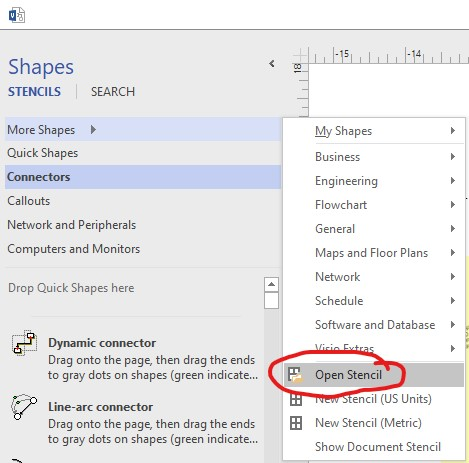
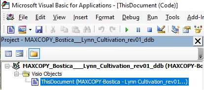

# Visio: Count Shapes

### A macro to count shapes in Visio

**_Macro name:_** UpdateCountText

---

## How does it work?

This macro is setup by default to count all relevant shapes/drops on every save and upon opening the Visio file.

You can also update the count values by clicking the Macro button in the Developer tab and running it from there. The macro name is listed above.

## Limitations

- Counted shapes/drops are limited to one single Visio sheet
- Macro is only setup to count shapes/drops from DDL_DropTypes stencil

## Prerequisites - _Critical!_

1. A macro-enabled Visio sheet (.vsdm)
   a. Convert your existing Visio file to a macro-enabled one by saving as and selecting macro-enabled visio from the dropdown
2. Imported DDL_Drop Stencil
   a. With the shapes panel open on the left, click "More Shapes", then "Open Stencil"
   
   b. Select DDL_DropTypes.vssm and click "Enable Macros" at the prompt
3. Add the macro code to the Visio file
   a. Enable the developer tab if it isn't present already
   b. In the Developer tab, press the "View Code" button
   c. Double click the document you want to count shapes in on the left (example highlighted in blue)
   
   d. Once the code window has opened in the right pane, paste in the code from CountShapes.vbs (note: you may get an error, this is expected and we will fix it in the next step)
4. Next we'll enable a dependency needed for the macro to run
   a. First, let's make sure the macro isn't trying to run. We can do this by clicking the blue stop button in the toolbar
   b. In the same window, navigate to "Tools" in the toolbar, then "References..."
   c. With the references window open, find "Microsoft VBScript Regular Expressions 5.5" and enable it
5. Change target text fields to track shape/drop counts (e.g. total drops, total fiber drops, etc...)
   a. In the code, <code>ctrl + f</code> and search for "CHANGE ME"
   b. These values (e.g. Sheet.2511) represent text fields on the Visio sheet. We need to change them in a new sheet to make sure the code knows which text fields to update
   c. To update these values, start by finding text field names by:
   1. Right-clicking on a text box you'd like to display a certain type of drop count in
   2. Clicking Show ShapeSheet and noting the value at the top of the window and to the right of the file name
      e.g. MAXCOPY-Bostica - Lynn Cultivation_rev01_ddb.vsdm:Bostica LLC 03/22:**Sheet.2511** <- This is what we are looking for
   3. Once we have our shape ID (e.g. Sheet.2511) we can update the respective value in the code
6. We are all set to run the macro! Test it out by saving the page and as long as there are DDL_DropType stencils on the page, you will see updated values
